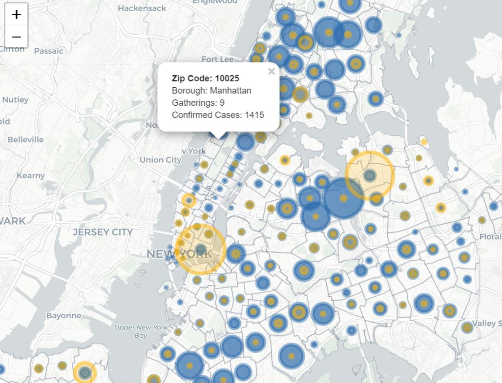

# Project 2: Shiny App Development


## Quantifying Social Distancing
Term: Fall 2020
+ **App**: https://ruiiii2886.shinyapps.io/social_distance/

+ **Team Members**:
	+ Hu, Qinzhe  qh2212@columbia.edu
	+ Kong, Depeng  dk3112@columbia.edu
	+ Liang, Rui  rl2886@columbia.edu
	+ Segal, Yotam  ys3114@columbia.edu
	+ Shi, Hankun  hs3142@columbia.edu

+ **Project summary**: 
	Social Distancing is an important factor in the fight against the Pandemic. The scientific community urges us to respect Social Distancing as it was proven an effective measure. 
	Nevertheless, to date, there has been very little research on how to quantify and measure social distancing. It is indeed a difficult task. People move around and it is virtually impossible to keep track on their interactions and physical distance from others. 
	Accurately measuring would allow society to predict cases and inform decision makers by providing real-time data, as apposed to the 14-days delayed testing results. 
	This is crucial in preventing lock-downs and would be beneficial in taking preemptive and highly targeted restrictions. Indeed, some nations are using cellular tracking measure social distancing, but in many this measure is unconstitutional. 
	In this study we explore ways in which society can measure social distancing by using control variables: Park Gatherings, collected by NYC, and Transportation data, collected by Apple.
+ **Contribution statement**: All team members contributed equally in all stages of this project. All team members approve our work presented in this GitHub repository including this contributions statement. 

Following [suggestions](http://nicercode.github.io/blog/2013-04-05-projects/) by [RICH FITZJOHN](http://nicercode.github.io/about/#Team) (@richfitz). This folder is orgarnized as follows.

```
proj/
├── app/
├── lib/
├── data/
├── doc/
└── output/
```

